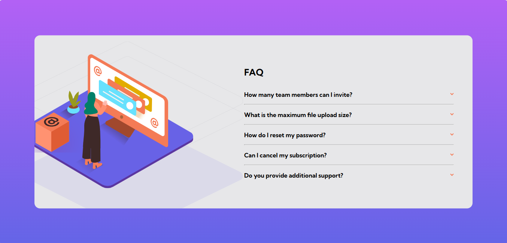

# Frontend Mentor - FAQ accordion

This is a solution to the [FAQ accordion
](https://www.frontendmentor.io/challenges/faq-accordion-wyfFdeBwBz). Frontend Mentor challenges help you improve your coding skills by building realistic projects.

## Table of contents

- [Overview](#overview)
  - [The challenge](#the-challenge)
  - [Screenshot](#screenshot)
  - [Links](#links)
  - [Installation](#Installation)
  - [Usage](#Usage)
- [My process](#my-process)
  - [Built with](#built-with)
  - [What I learned](#what-i-learned)
  - [Continued development](#continued-development)
- [Author](#author)
- [Acknowledgments](#Acknowledgments)

## Overview

### The challenge

In this challenge, you'll build an FAQ accordion. This is an extremely common front-end pattern, so it's an excellent opportunity to get some practice in!

Your users should be able to:

- Hide/Show the answer to a question when the question is clicked
- Navigate the questions and hide/show answers using keyboard navigation alone **Use the Tab key to navigate through the questions. Once a question is focused, press the Enter or Space key to toggle the answer**
- View the optimal layout for the interface depending on their device's screen size
- See hover and focus states for all interactive elements on the page

### Screenshot



### Links

- Solution URL: [here](https://github.com/olahasan/HTML_CSS_AND_J.S_Frontend-Mentor_NEWBIE-FAQ-Accordion-Card)

- Live Site URL: [here](https://olahasan.github.io/HTML_CSS_AND_J.S_Frontend-Mentor_NEWBIE-FAQ-Accordion-Card/)

## Installation

To get a local copy up and running, follow these simple steps:

1. **Clone the repository**:

   ```sh
   git clone https://github.com/your-username/your-repo-name.git
   ```

2. **Navigate to the project directory**:

   ```sh
   cd your-repo-name
   ```

3. **Open the project in your preferred code editor**.

## Usage

To use the components in your project, you can simply copy the HTML, CSS, and JavaScript files into your project directory. Make sure to link the CSS and JS files correctly in your HTML.

## My process

### Built with

- Semantic HTML5 markup
- CSS custom properties
- Flexbox
- CSS Grid
- Mobile-first workflow
- JavaScript

### What I Learned

In this project, I learned how to create a responsive FAQ accordion card. I used CSS animations to create smooth transitions when showing and hiding the answers. I also improved my JavaScript skills by adding event listeners and manipulating the DOM.

### Continued Development

I plan to continue improving my CSS and JavaScript skills by working on more Frontend Mentor challenges. I also want to explore more advanced CSS techniques and JavaScript frameworks.

### Author

Frontend Mentor - @olahasan<br>
GitHub - @olahasan

### Acknowledgments

I would like to thank the **Frontend Mentor** for providing this challenge and to the community for their support and feedback
